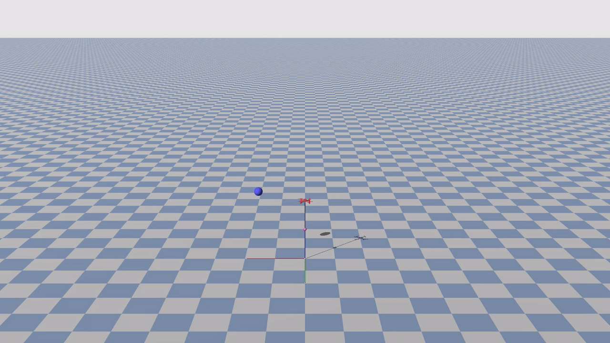

<div align="center">

  # FLARE: Agile Flights for Quadrotor Cable-Suspended Payload System via Reinforcement Learning

  **IEEE Robotics and Automation Letters (RA-L), 2026**

  <div>
    <a href="https://scholar.google.com/citations?user=dXMBf_0AAAAJ&hl=zh-CN&oi=sra" target="_blank">Dongcheng Cao</a>,
    <a href="https://scholar.google.com/citations?user=ubQnCiQAAAAJ&hl=zh-CN&oi=sra" target="_blank">Jin Zhou</a>,
    <a href="https://scholar.google.com/citations?user=r8ugMOwAAAAJ&hl=zh-CN&oi=sra" target="_blank">Xian Wang</a>,
    <a href="https://scholar.google.com/citations?user=-MINoSEAAAAJ&hl=zh-CN&oi=sra" target="_blank">Shuo Li</a>
  </div>

  <small>
    College of Control Science and Engineering, Zhejiang University
  </small>

  <br><br>

  <a href="https://arxiv.org/abs/2508.09797"></a> &nbsp;<a href="https://arxiv.org/pdf/2508.09797"></a> &nbsp; <a href="https://bei11hai.github.io/Flare-web/"></a> &nbsp; <a href="https://youtu.be/CASn9SbnMHo"></a> &nbsp; <a href="https://www.bilibili.com/video/BV1cBFTz6Eq7/?spm_id_from=333.1387.favlist.content.click&vd_source=3a757a9cdd97a3eeaf5f80ae50b97b4d"></a> &nbsp; <a href="https://github.com/BEI11HAI/Flare"></a>

  <br><br>
  
  <p align="center">
    
  </p>
</div>

---

## Abstract

**FLARE** is a reinforcement learning (RL) framework designed to tackle the formidable challenge of agile flight for quadrotor cable-suspended payload systems. Due to the underactuated, highly nonlinear, and hybrid dynamics of such systems, traditional methods often struggle.

In this work, we present a method that:
- **Directly learns** an agile navigation policy from high-fidelity simulation.
- Outperforms state-of-the-art optimization-based approaches (Impactor) by a **3x speedup** in gate traversal.
- Achieves successful **zero-shot sim-to-real transfer**, demonstrating remarkable agility and safety in real-world experiments.

## Installation

This repository depends on [GenesisDroneEnv](https://github.com/KafuuChikai/GenesisDroneEnv) and the official [Genesis](https://github.com/Genesis-Embodied-AI/Genesis) simulator.

⚠️ **Important**: To ensure stable reproducibility, we **strongly recommend** using the specific commit version of Genesis that this project was developed on.

```bash
# 1. Clone Genesis and checkout the specific commit
git clone https://github.com/Genesis-Embodied-AI/Genesis.git
cd Genesis
git checkout 382cf4ca12c0c142adcf2fa7675eef65caf0c661
pip install -e .

# 2. Install rsl_rl
git clone https://github.com/leggedrobotics/rsl_rl
cd rsl_rl
git checkout v1.0.2
pip install -e .

# 3. Clone Flare
git clone https://github.com/BEI11HAI/Flare.git
cd Flare
```


## Usage

We provide three challenging scenarios for validation: **Agile Waypoint Passing**, **Payload Targeting**, and **Agile Gate Traversal**.

Below are the instructions to evaluate pre-trained models or train your own policies for **Scenario I: Agile Waypoint Passing**. (Instructions for other scenarios will be updated soon).

### 1. Evaluate Pre-trained Policy
You can directly evaluate the pre-trained model provided in `logs/s1_waypoint_passing`.

```bash
python waypoint_passing_eval.py
# Add --record to save a video
# python waypoint_passing_eval.py --record
```

Then you will see:

<p align="center">
  
</p>

### 2. Train from Scratch
To train a new policy for the waypoint passing task:

```bash
python waypoint_passing_train.py
# python waypoint_passing_train.py --record 
```

## Citation

If you find our work helpful, please consider citing:

```bibtex
@article{cao2025flare,
  title={FLARE: Agile Flights for Quadrotor Cable-Suspended Payload System via Reinforcement Learning},
  author={Cao, Dongcheng and Zhou, Jin and Wang, Xian and Li, Shuo},
  journal={arXiv preprint arXiv:2508.09797},
  year={2025}
}
```

---
<div align="center">
  Developed at <a href="http://nesc.zju.edu.cn/" target="_blank">NeSC-Lab</a>, Zhejiang University.
</div>
